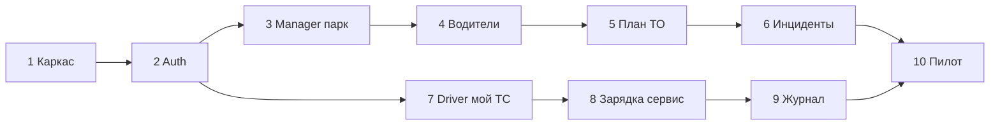

# Роадмап: 10 спринтов

Принцип: **по итогам каждого спринта — рабочий прототип**, который можно установить на устройство и показать заказчику (демо-сценарий 5–10 минут).

Длина спринта условная (1–2 недели); границы можно сдвигать, но **инкремент демонстрабельности** сохраняем.

Общие допущения:

- Общий **дизайн-токены** и компоненты (Material 3), светлая/тёмная тема.
- Слой API с **мок-реализацией** и переключателем на staging; там, где бэкенд ещё не готов, прототип не блокируем.
- Два модуля приложения: `:app-manager`, `:app-driver` (или два `applicationId` в одном проекте — решение фиксируется в спринте 1).

---

## Спринт 1 — Каркас и два «коробочных» приложения

**Цель:** репозиторий собирается в Android Studio, на телефоне две иконки с разными названиями.

**Делаем:**

- Gradle Kotlin DSL, minSdk / targetSdk по договорённости с заказчиком.
- Два `applicationId`, общий модуль `:core:ui` (тема, цвета, типографика).
- Экран-заглушка после splash: логотип/название роли («Управление парком» / «Водитель») и одна кнопка «Далее».

**Демо заказчику:** установка обоих APK, объяснение разделения ролей.

**Критерий готовности:** CI (опционально) собирает debug-сборки обоих приложений.

---

## Спринт 2 — Вход и сессия (оба приложения)

**Цель:** осмысленный первый экран после установки — вход в систему.

**Делаем:**

- Экраны логина (телефон/e-mail + пароль или OTP — по решению с заказчиком).
- Клиент REST: выдача токена по контракту `accessToken` + `expiresAt`, заголовок `Authorization: Bearer`.
- Локальное безопасное хранение токена (EncryptedSharedPreferences / DataStore + шифрование).
- Обработка ошибок из спецификации: `missing_token`, `invalid_token`, `expired_token`, и т.д. — пользователю понятные тексты.
- После входа — переход в «главную заглушку» приложения.

**Демо заказчику:** вход в manager и в driver (можно одним тестовым пользователем с разными ролями или двумя учётками).

**Критерий готовности:** без валидного токена защищённые экраны недоступны; logout очищает сессию.

---

## Спринт 3 — Manager: парк электрогрузовиков

**Цель:** управляющий видит **свой** список машин и карточку ТС.

**Делаем:**

- Список ТС: статус (онлайн/стоянка/в пути — упрощённо), номер, модель, заряд/SOC если есть в API.
- Карточка ТС: ключевые поля, кнопка «назад к списку».
- Pull-to-refresh, состояния загрузки и ошибки сети.
- Фильтр/поиск по госномеру или VIN (минимум поиск по строке на клиенте).

**Демо заказчику:** пройти по 3–5 машинам, показать обновление списка.

**Критерий готовности:** данные с API или убедительный мок с теми же моделями DTO, что пойдут в прод.

---

## Спринт 4 — Manager: водители и привязка к парку

**Цель:** связка «кто на какой машине допущен».

**Делаем:**

- Список водителей, карточка водителя (ФИО, контакт, рейтинг/статус — по полям API).
- Из карточки ТС — список допущенных водителей (или ссылка на allowances); из водителя — доступные машины.
- Упрощённое действие для демо: «назначить/снять» (если API готов; иначе UI + мок с пометкой «скоро»).

**Демо заказчику:** сценарий «нашёл водителя → вижу его машины» и наоборот.

**Критерий готовности:** навигация без тупиков; пустые состояния («нет допусков»).

---

## Спринт 5 — Manager: плановое сервисное обслуживание

**Цель:** планирование и обзор ТО, чтобы не упускать регламент.

**Делаем:**

- Календарь или список по датам: запланированные работы (ТО, инспекция, замена расходников).
- Создание/редактирование записи плана (тип, дата, ТС, комментарий) — в объёме, который позволяет API; иначе локальный черновик + синхронизация позже.
- Напоминание в приложении (локальное notification по расписанию) для ближайшего события — хотя бы одно демо-напоминание.

**Демо заказчику:** добавить ТО на завтра, показать его в списке и срабатывание тестового напоминания.

**Критерий готовности:** заказчик понимает, как план превращается в напоминание диспетчеру.

---

## Спринт 6 — Manager: внеплановые ситуации и оперативная картина

**Цель:** быстро реагировать на сбои, аварии, простои.

**Делаем:**

- Лента «инцидентов» / критических логов (привязка к ТС и времени), фильтр по срочности.
- Деталика инцидента: описание, ТС, статус обработки (новый / в работе / закрыт).
- Действие для диспетчера: смена статуса, комментарий (если API есть; иначе мок).
- Опционально: push о новом критическом событии (хотя бы Firebase test message на одно устройство).

**Демо заказчику:** «пришло событие → открыл → принял в работу → закрыл».

**Критерий готовности:** понятный SLA-подобный поток в UI даже на тестовых данных.

---

## Спринт 7 — Driver: «мой грузовик» за один-два экрана

**Цель:** водитель без лишних касаний видит суть по своему ТС.

**Делаем:**

- Главный экран после входа: назначенная машина (или выбор из допущенных, если их несколько).
- Крупно: заряд/SOC, остаток пробега (если есть), предупреждения, VIN/госномер, кнопки «Зарядка» и «Сервис» (переходы на следующие экраны-заглушки).

**Демо заказчику:** водитель открыл приложение утром и за 10 секунд понял состояние машины.

**Критерий готовности:** данные с API под роль Driver или мок с реалистичными значениями.

---

## Спринт 8 — Driver: зарядка и сервисная информация

**Цель:** быстрый доступ к инструкциям и контактам, без звонка диспетчеру по мелочам.

**Делаем:**

- Экран «Зарядка»: тип разъёма, рекомендуемая мощность, чеклист перед зарядкой (статичный контент + при необходимости CMS/API).
- Экран «Сервис»: ближайшее плановое ТО, телефон/чат сервиса, ссылка на краткую памятку (PDF/WebView или встроенный текст).
- Кнопка экстренного вызова (tel:) — по политике заказчика.

**Демо заказчику:** сценарий «приехал на станцию → открыл чеклист → позвонил в сервис».

**Критерий готовности:** всё работает офлайн для статичного контента (встроенный кеш).

---

## Спринт 9 — Driver: бортовой журнал и поддержка (единое окно)

**Цель:** фиксировать проблемы и вопросы в одном месте; диспетчер/поддержка видит поток (через тот же или связанный API).

**Делаем:**

- Список записей журнала (дата, ТС, краткий текст, статус).
- Создание записи: категория (поломка, вопрос, ДТП, прочее), текст, фото с камеры/галереи (сжатие), отправка на сервер или очередь.
- Экран статуса обращения (как тикет): открыт / в работе / решён + комментарий поддержки при наличии API.
- Для manager-части (минимум): просмотр входящих обращений по парку в отдельной вкладке или deep link из уведомления (если успеваем).

**Демо заказчику:** водитель создал запись с фото → в manager видно новое обращение (или в общей ленте инцидентов).

**Критерий готовности:** сквозной сценарий «сообщил — не потерялось» на тестовом стенде.

---

## Спринт 10 — Пилотная готовность: стабильность, офлайн, релиз

**Цель:** прототип уровня «можно отдать на пилот ограниченной группе».

**Делаем:**

- Офлайн: черновики журнала и очередь отправки; индикатор «не синхронизировано».
- Обработка плохой сети, таймауты, повтор запросов (идемпотентность на стороне API — по возможности).
- Базовая аналитика (Firebase Analytics / аналог): ключевые события (login, создание журнала, просмотр ТС).
- Подпись release-сборки, internal testing track (Play Console) или аналог распространения APK/AAB.
- Чеклист безопасности: не логировать токены, ProGuard/R8 правила для release.

**Демо заказчику:** установка через тестовый канал, сценарий «день в поле» без крашей на главных потоках.

**Критерий готовности:** зафиксированный scope пилота и список известных ограничений (known issues).

---

## Зависимости между спринтами

После спринта 2 ветки **Manager** (3→6) и **Driver** (7→9) можно вести **параллельно** двумя разработчиками; спринт 10 объединяет качество и выпуск.

---

## Артефакты для заказчика в конце каждого спринта

| Артефакт | Описание |
|----------|----------|
| Сборки | Два AAB/APK (debug или internal) с номером спринта в `versionName` |
| Сценарий демо | 1 страница: шаги и ожидаемый результат |
| Короткий changelog | Что нового по сравнению с прошлым спринтом |
| Риски и блокеры | Зависимости от бэкенда, контента, юридических ограничений (запись, камера) |

---

## Открытые вопросы к заказчику (желательно закрыть до спринта 2)

1. Один пользователь с двумя ролями или строго разные учётки под Manager и Driver?
2. Обязательный OTP, корпоративный SSO или достаточно пароля на первом этапе?
3. Нужны ли push-уведомления в пилоте и через какой провайдер (FCM)?
4. Языки интерфейса: только русский или сразу i18n?
5. Требования к хранению персональных данных и региону обработки (влияет на аналитику и бэкапы).
